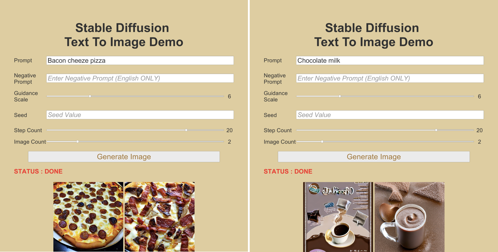
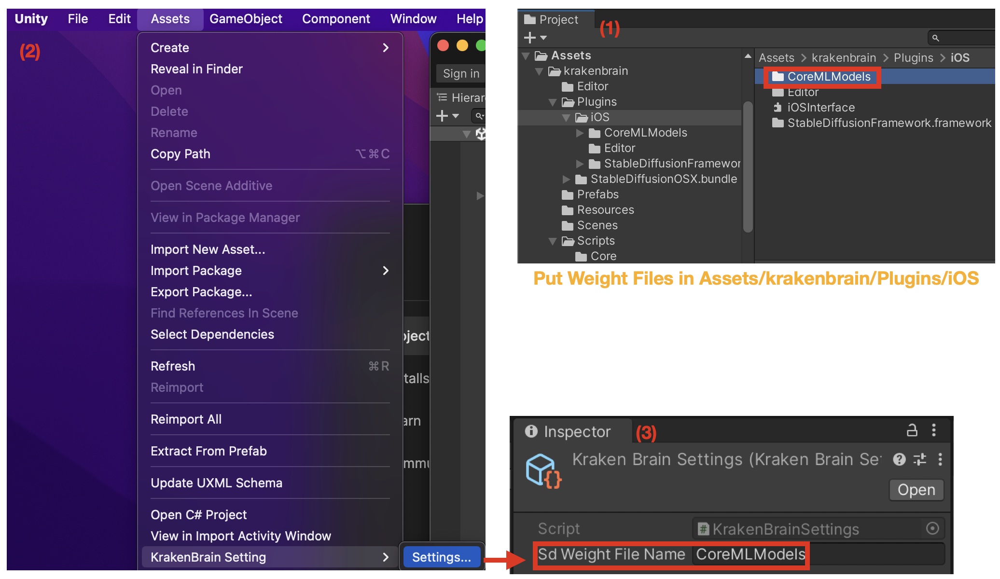
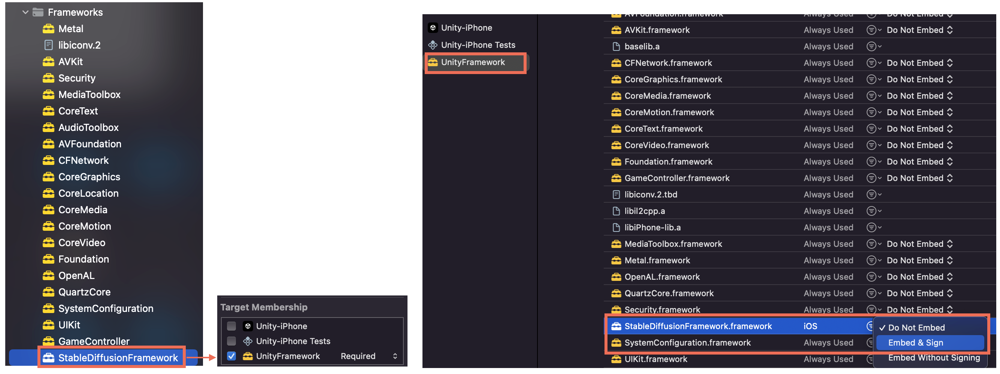

# KrakenBrain - DeepLearning OnDevice Unity SDK
Run DeepLearning on Device at runtime in Unity

## Support DeepLearning Model
- [StableDiffusion - CoreML](#stablediffusion)

|   DeepLearning Model  |    Android    |   iOS     |   Mac OSX     |   Window  |
| :-------------------: | :-----------: | :-------: | :-----------: | :-------: |
|    StableDiffusion    |***Not*** Support|**Support**|***Not*** Support|***Not*** Support|

## StableDiffusion

    

 

### System Requirements

    
 Details (Click to expand) 

Target Device Runtime:
| iPadOS, iOS |
| :---------: |
|    16.2     |

Target Device Runtime
| iPadOS, iOS |
| :---------: |
|    17.0     |

Target Device Hardware Generation
|   iPad   |   iPhone   |
| :------: | :---------:|
|    M1    |     A14    |

### Using Ready-made Core ML Models from Hugging Face Hub

    
 Details (Click to expand) 

- 6-bit quantized models (suitable for iOS 17)
    - [CompVis/stable-diffusion-v1-4](https://huggingface.co/apple/coreml-stable-diffusion-1-4-palettized)
    - [runwayml/stable-diffusion-v1-5](https://huggingface.co/apple/coreml-stable-diffusion-v1-5-palettized)
    - [stabilityai/stable-diffusion-2-base](https://huggingface.co/apple/coreml-stable-diffusion-2-base-palettized)
    - [stabilityai/stable-diffusion-2-1-base](https://huggingface.co/apple/coreml-stable-diffusion-2-1-base-palettized)

- [Converting Models to Core ML](https://github.com/apple/ml-stable-diffusion/blob/main/README.md#-converting-models-to-core-ml)

### Using Stable Diffusion onDevice in Unity

    
 Details (Click to expand) 

**Step 1** : Put the weight file on "Assets/krakenbrain/Plugins/iOS"

**Step 2** : Input the weight file name on KrakenBrain Settings

    

**Step 3** : Build iOS & export xcode project

**Step 4** : Go to Frameworks directory and Change StableDiffusionFramework Target Membership Unity-iPhone to UnityFramework

**Step 5** : Set StableDiffusionFramework to Embed & Sign

    

### Issues
- Low Memory Issue frequentily occured

Reference : [Apple ml-stable-diffusion](https://github.com/apple/ml-stable-diffusion/blob/main/README.md)

